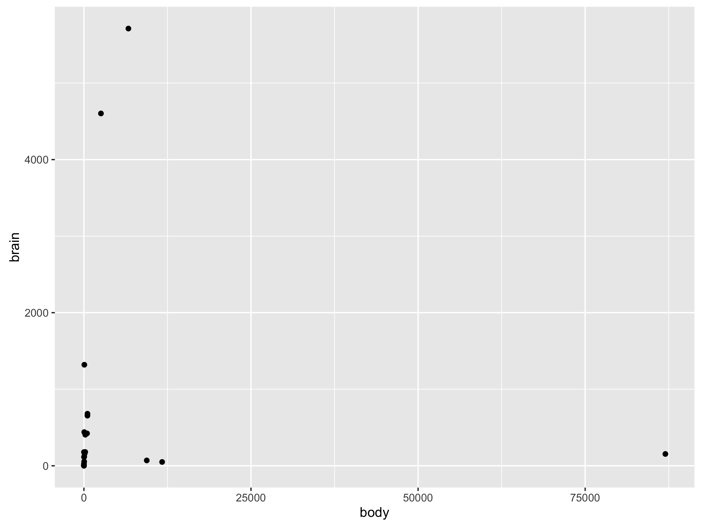
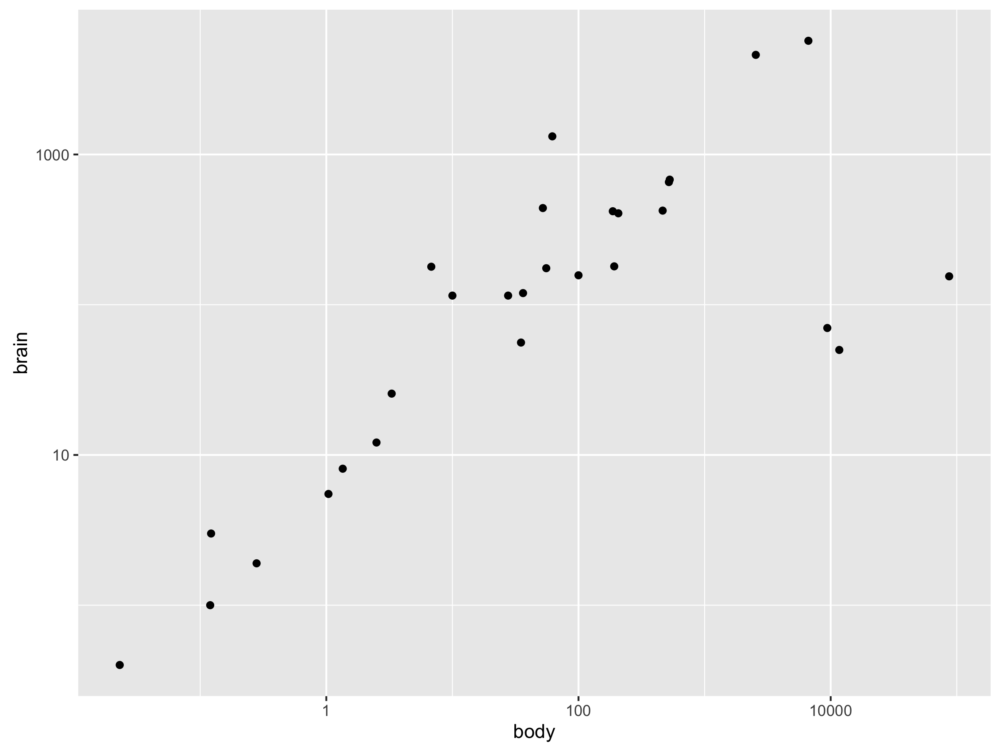
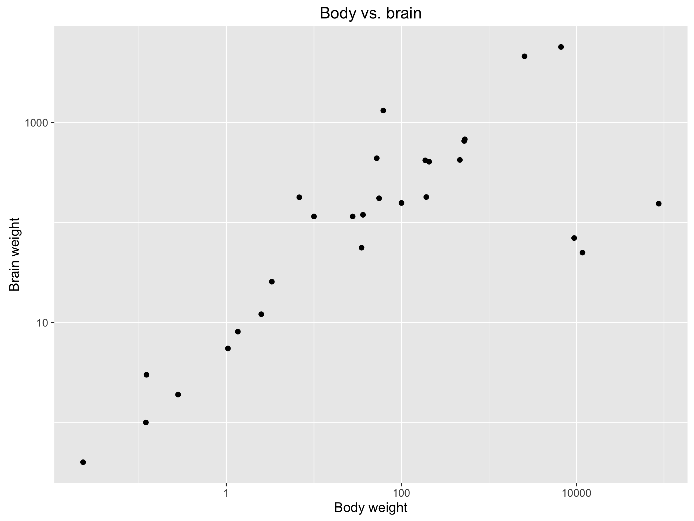
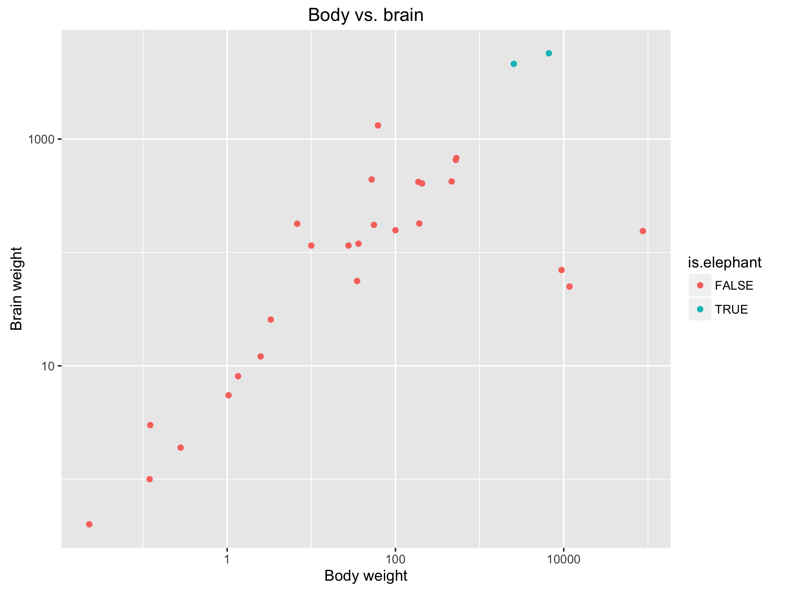
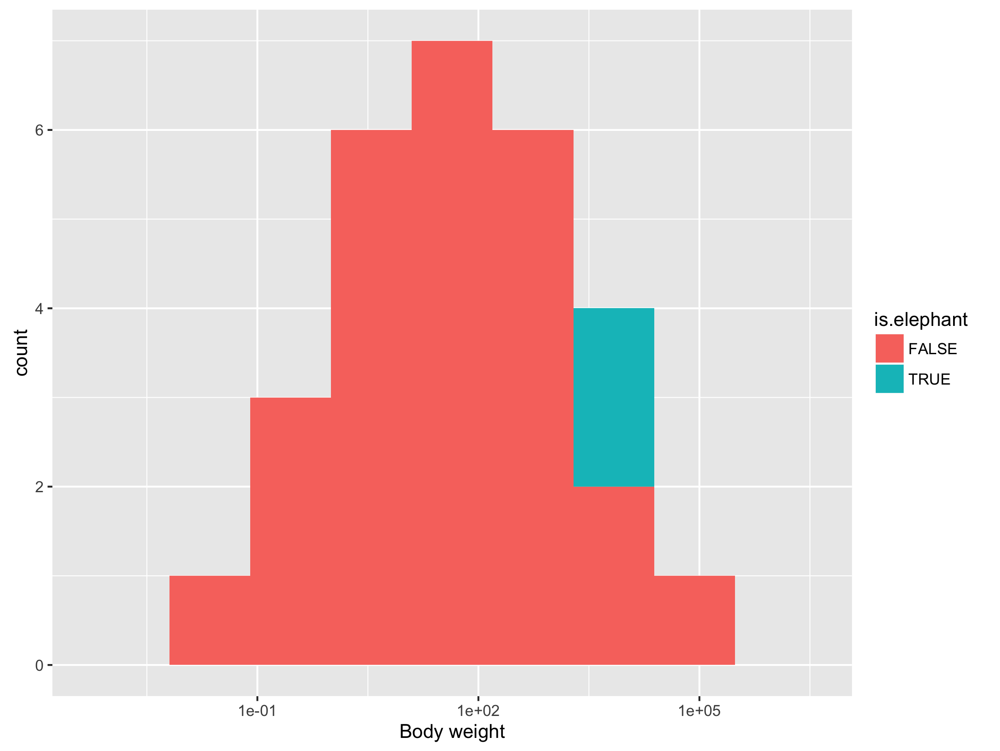

# Introduction to R

## What is R?

R is an open source programming language that is designed for data
analysis and statistics.
All information about R can be found at
<http://www.r-project.org/>.

We highly recommend using R through the **RStudio** IDE (Integrated Development Environment) which can be downloaded at <https://www.rstudio.com> for Microsoft Windows, Apple OS X, and Linux.
Alternatively, a more basic version of R can be downloaded from the R project website.

## A (brief) introduction to programming in R

We shall first (re-)introduce some of the basic ideas of computer programming.
Although these are demonstrated using R most of the concepts within this section can be applied in some form to most programming languages.
**If you are comfortable using R from previous experience or from taking other modules in the SysMIC course, please feel free to [skip this section](#ggplot2).**

### Variables

**Variables** allow us to store numbers for use in later calculations.
For example:

    > num_of_pages <- 7
    > av_words_per_page <- 300
    > num_of_pages*av_words_per_page
    [1] 2100

First note that in R we generally use the assignment operator `<-` (rather than `=`, which is used in many other languages)^[The reason why we use `<-` is rather technical, but the interested reader should refer to [this explaination](http://stackoverflow.com/questions/1741820/assignment-operators-in-r-and).].
On the first line, we have defined a variable `num_of_pages` and **assigned** it the value 7; and on the second line, we have defined a variable `words_per_page` and assigned it the value 300.
Finally, to get the total number of pages, on the third line we multiply the two numbers together (using the `*` operator) that results in the answer being printed to the screen.

We can also **assign** the values of a calculation to
another variable, for example:

    > total_pages <- num_of_pages*av_words_per_page
    > total_pages
    [1] 2100

### Vectors

**Vectors**, or **arrays**, are a special type of variable that comprise a list of items (the **elements** of the vector).
For example:

    > words_per_page <- c(285, 298, 349, 253, 305, 313, 297)
    > words_per_page
    [1] 285 298 349 253 305 306 297

We have created a vector containing the number of words per page for seven pages.
In R we create a vector using the operator `c`, which stands for **combine**.
The elements of the vector are listed inside a pair of brackets `c(...)`, with commas used to separate the items.

R has a range of inbuilt **functions** which we can immediately apply to our vector to determine useful information.

    > length(words_per_page)
    [1] 7
    > mean(words_per_page)
    [1] 300
    > sum(words_per_page)
    [1] 2100

We can access a given element of a vector using an **index**.
This is an integer which refers to the position of the element in the vector.
In R, the first element in the vector has an index of 1^[In other languages such as C or Python first element in the vector has an index of 0.].
To access an element in a vector we use the `[ ]` operator.

    > words_per_page[1]
    [1] 285
    > words_per_page[3]
    [1] 349
    > words_per_page[8]
    [1] NA

Note that if we try and access an array element that does not yet exist we get the values `NA`, which stands for **missing data**.
R has lots of mechanisms for handling missing data which can be very useful when performing statistical analyses.

To create this eighth element, we can assign to it directly:

    > words_per_page[8] <- 316
    > words_per_page
    [1] 285 298 349 253 305 313 297 316

The combine operator can also join two vectors:

    > extra_pages <- c(298, 328, 285)
    > c(words_per_page, extra_pages)
    [1] 285 298 349 253 305 313 297 316 298 328 285

R has shortcuts to generate vectors filled with sequences of numbers.
For integer sequences, we can use the colon operator:

    > 1:8
    [1]  1  2  3  4  5  6  7  8

Alternatively, we can use the `seq` function and specify the start and
end and increment:

    > seq(from=1, to=4, by=0.5)
    [1] 1.0 1.5 2.0 2.5 3.0 3.5 4.0

We can often use operators on a variable (containing a single value) and a vector, and return a sensible result.
In this case, R will apply the operator to the variable and each element of the vector in turn.

    > words_per_page <- c(285, 298, 349, 253, 305, 313, 297)
    > more_words <- 20
    > words_per_page + more_words
    [1] 305 318 369 273 325 333 317 336
    > av_letters_per_word <- 8
    > words_per_page*av_letters_per_word
    [1] 2280 2384 2792 2024 2440 2504 2376 2528

We can also often use operators on two vectors of equal length.
In this case, R will apply the operator to each pair of elements in turn.
An operator for which this applies is called an **element-wise** operator.

    > words_per_page <- c(285, 298, 349, 253, 305, 313, 297)
    > more_words_per_page <- c(20, 26, 19, 18, 21, 12, 26)
    > words_per_page + more_words_per_page
    [1] 305 324 368 271 326 325 323

### Matrices

A **matrix** can be defined in R as follows:

    > m <- matrix(nrow=3, ncol=3, data=c(1,2,3,4,5,6,7,8,9) )
    > m
         [,1] [,2] [,3]
    [1,]    1    4    7
    [2,]    2    5    8
    [3,]    3    6    9

We need to specify the number of rows, the number of columns, and the entries in the matrix. Note that the matrix is filled column-wise by default.

### Data types

We often want to store different types of data in our variables.
R has three basic data types:

- **numeric**, which can be integer or real
- **character**, also known as strings
- **logical**, also known as booleans which can hold only the values `TRUE` and `FALSE`

We can use the `class` function to
get information on variables.

    > num <- 5
    > str <- "Hello world!"
    > tof <- TRUE
    > class(num)
    [1] "numeric"
    > class(str)
    [1] "character"
    > class(tof)
    [1] "logical"

We can treat vectors of strings and booleans in the same way as vectors of numbers.

    > strs <- c("Hello", "world!")
    > strs
    [1] "hello" "world"

Logical results are returned from certain comparison operations (`<` less than; `>` greater than; `==` equal to; `!=` not equal to):

    > 2 > 1
    [1] TRUE
    > 2 < 1
    [1] FALSE
    > 2 == 1
    [1] FALSE
    > 2 != 1
    [1] TRUE

### Inbuilt functions

R contains a huge number of inbuilt **functions**.
For instance to generate ten (uniformly distributed) random numbers between minus five and five:

    > x <- runif(10, min=-5, max=5)

Here we used the function `runif` with three **arguments**: the number of random numbers we wanted (`10`); the minimum value (`min=-5`); and the maximum values (`max=5`).
This function then **returned** a vector of ten random numbers, which were **assigned** to the variable `x`.
In this example:

- The first argument (`n`) is a **positional** argument. We rely on the fact that R knows that the *first* argument to the `runif` function should be the number of random numbers wanted.
- The other two arguments (`min`, `max`) are **named** arguments. We explicitly tell R which arguments these values correspond to.

We can find out the number of arguments a function takes, and their order by using the **documentation**.
Within R the easiest way to do this is to use the `help` function or the `?` operator:

    > help(runif)
    > ? runif

If we run this, under usage we see `runif(n, min = 0, max = 1)`.
This means that `runif` expects three arguments in the order: `n`, `min`, then `max`.
However, `min` and `max` both have default values (0 and 1, respectively).
So if we wanted to generate ten random numbers between 0 and 1, the following are equivalent:

    > x <- runif(10)
    > x <- runif(10, 0, 1)
    > x <- runif(10, min=0, max=1)
    > x <- runif(n=10, min=0, max=1)

(Of course running `runif` multiple times will give different answers, because we are generating new random numbers each time!)

### Numerical functions

R has a number of inbuilt functions that allow us to apply standard mathematical functions, for example: `exp`, `log10`, `abs`, `sqrt`, `cos`, `sin`, `tan`.
Most inbuilt R functions operate on vectors in an element-wise fashion so that the function is applied to each element in turn.

### Statistical functions

R also contains many inbuilt functions for standard data analysis, for example: `mean(x)`, `sd(x)` (standard deviation), `median(x)`, `sum(x)`.

We have already seen `runif` used to generate random numbers, R also has other functions for **pseudo random number generation** of other distributions, such as: `rnorm` (normal), `rbinom` (binomial).

### Data frames

**Data frames** are a useful way to store and manipulate data in R.
They are tables of data, with rows containing a set of observations and columns referring to a particular (experimental) variable.

For instance, we want to create the table holding the body and brain weights of a number of animals.

| animal          | body    | brain |
|-----------------|---------|-------|
| Mountain beaver |   1.350 |   8.1 |
| Cow             | 465.000 | 423.0 |
| Grey wolf       |  36.330 | 119.5 |

    > animals <- c("Mountain beaver", "Cow", "Grey wolf", "Goat")
    > bodyweight <- c(1.35, 465.00, 36.33, 27.66)
    > brainweight <- c(8.1, 423.0, 119.5, 115.0)
    > df <- data.frame(row.names=animals, body=bodyweight, brain=brainweight)
    > df
                      body brain
    Mountain beaver   1.35   8.1
    Cow             465.00 423.0
    Grey wolf        36.33 119.5
    Goat             27.66 115.0

We can access the column and row names using the `names` and the `row.names` functions, respectively.

    > names(df)
    [1] "body"  "brain"
    > row.names(df)
    [1] "Mountain beaver" "Cow"             "Grey wolf"       "Goat"   

We can access each column in multiple equivalent ways:

    > df$body
    [1]   1.35 465.00  36.33  27.66
    > df[,1]
    [1]   1.35 465.00  36.33  27.66
    > df[,"body"]
    [1]   1.35 465.00  36.33  27.66

Or to access a single data-point:

    > df[2,1]
    [1] 465
    > df$body[2]
    [1] 465
    > df[2,"body"]
    [1] 465
    > df["Cow","body"]
    [1] 465

To select specific ranges of rows we can use the colon operator, or lists of indexes:

    > df[1:2,]
                      body brain
    Mountain beaver   1.35   8.1
    Cow             465.00 423.0
    > df[c(1,3),]
                     body brain
    Mountain beaver  1.35   8.1
    Grey wolf       36.33 119.5

The `subset` function will return rows that satisfy given (logical) requirements:

    > subset(df, brain > 100)
                body brain
    Cow       465.00 423.0
    Grey wolf  36.33 119.5
    Goat       27.66 115.0
    > subset(df, brain > 100 & body < 100)
               body brain
    Grey wolf 36.33 119.5
    Goat      27.66 115.0

Similarly, the `which` function will return the indices of the rows that match the requirements:

    > which(df$brain > 100 & df$body < 100)
    [1] 3 4

We can add rows to a data frame (note that `log10` is an element-wise function):

    > df$log_body <- log10(df$body)
    > df$log_brain <- log10(df$brain)

To apply operations to all of the columns of a data frame, we can use the `apply` function:

    > apply(df, MARGIN=2, mean)
          body      brain  log_brain
    132.585000 166.400000   1.918223

Or to apply a function to each row:

    > apply(df, MARGIN=1, sum)
    Mountain beaver             Cow       Grey wolf            Goat
           10.35849       890.62634       157.90737       144.72070

### Reading and writing data

To read and write data from files, we can use the `read.table` and `write.table` commands.
For example, to write the data frame `df` to the file "data.txt":

    > write.table(df, "data.txt")

To read that file back (for example in another R script):

    > read.table("data.txt")

### Programming in R

Often in programs we want to perform a certain operation repeatedly.
We can do that using a **for loop**.
For example, to calculate the first ten Fibonacci numbers^[If you are unsure what the Fibonacci numbers are, see <https://en.wikipedia.org/wiki/Fibonacci_number>.]:

    > x <- vector("integer", 10) # initialise x
    > x[1:2] <- 1 # set the first two values to 1
    > for(i in 3:10){ # loop from 3 to 10
    +   x[i] = x[i-1] + x[i-2]
    + }

(Anything after a `#` symbol is a **comment**, which R ignores.)

We may want out program to perform different actions depending on the value of a variable.
To do this, we need to use an **if statement** or an **if-else statement**:

    > n = 1
    > if (n < 3) {
    +   print("That's a small number.")
    + } else {
    +   print("That's a big number.")
    [1] "That's a small number."

If you have bits of code that you want to repeat throughout your program, then the best approach is define your own function.
We use the notation `function (input variables) {...}`, and use the `return` function to specify the value we want to return from the function.
For example, a simple function to add one to any other single number:

    > plus1 <- function (x) { return(x + 1) }
    > plus1(5)
    [1] 6

We can put all of the above together to write a function that will return the first $n$ Fibonacci numbers, as long as $n>3$:

    > fibonacci <- function (n) {
    +   if (n < 3) {
    +     print("Please pick a value of n greater than 2.")
    +   } else { # if n is large enough
    +     # prepare output vector
    +     x <- vector("integer", n) # initialise x
    +     x[1:2] <- 1 # set the first two values to 1
    +     # calculate Fibonacci numbrs
    +     for(i in 3:n){
    +       x[i] = x[i-1] + x[i-2]
    +     }
    +     return(x) #
    +   }
    + }

Then, using our function:

    > fibonacci(2)
    [1] "Please pick a value of n greater than 2."
    > fibonacci(12)
    [1]   1   1   2   3   5   8  13  21  34  55  89 144

## External packages

One of the greatest strengths of R is the huge variety of external **packages**.
These are collections of functions which have been written for R by one or more authors and made available in the CRAN package repository <http://cran.r-project.org/>.

To install a package that is listed in CRAN use the `install.packages` function.
To install a package (for example *ggplot2*) use:

    > install.packages("ggplot2", dependencies=TRUE)

You may need to select a **mirror**, a site to download the package from, choose the nearest to your geographical location.

To use an installed package in R, use the `library` function:

    > library(ggplot2)

## Plotting with the ggplot2 package {#ggplot2}

The **ggplot2** package (homepage: <http://ggplot2.org>) provides a different way to create figures in R, other than the default functions (such as `plot` or `hist`).
To install ggplot2 use the `install.packages` function and to use any the package use the `library` function, as described above.

To demonstrate ggplot we will use a data set (a data frame) defined in the *MASS* package:

    > library(MASS)
    > df <- Animals
    > df$is.elephant = FALSE
    > df$is.elephant[c(7,15)] = TRUE
    > head(df)
                        body brain is.elephant
    Mountain beaver     1.35   8.1       FALSE
    Cow               465.00 423.0       FALSE
    Grey wolf          36.33 119.5       FALSE
    Goat               27.66 115.0       FALSE
    Guinea pig          1.04   5.5       FALSE
    Dipliodocus     11700.00  50.0       FALSE

In ggplot2 we *build* a plot, by first defining a new plot object using the `ggplot` function (note there is no 2!).

    > library(ggplot2)
    > g <- ggplot(data=df, mapping=aes(x=body, y=brain))

In the simplest use case, the `ggplot` function takes arguments: the data frame containing the data we wish to plot (`data=df`); and a *mapping* of the data frame's columns into plot characteristics using the `aes` function (`mapping=aes(x=body, y=brain)`).
In this case we are setting the x-axis to represent body weight and the y-axis to represent the brain weight.
We can also specify other plot characteristics here, such as `size` of a scatter point or `colour` of a categorical column – we will return to this later.

While we have *initialised* the plot, we have yet to tell ggplot2 what type of plot we wish to use.
We do this by *adding* features to the plot object.

To plot a simple scatter plot use:

    > g + geom_point()

If you are using RStudio or a similar IDE, this plot should appear automatically.
If it doesn't, you can save the plot using the `ggsave` function:

    > ggsave('plot1.png')

This should result in a plot that looks identical to this:

This plot can be improved in a few ways.
First, we should log both of the axes:

    > g + geom_point() + scale_x_log10() + scale_y_log10()

Perhaps we can also be a little bit more descriptive with the labels:

    > g + geom_point() + ggtitle("Body vs. brain") +
    +   scale_x_log10("Body weight") + scale_y_log10("Brain weight")

If we want to use colour to indicate the value in the `is.elephant` column, we need to define a new mapping.
Note that we can do this directly in the `geom_point` function arguments, or in the `ggplot` function arguments.

    > g + geom_point(aes(colour=is.elephant)) + ggtitle("Body vs. brain") +
    +   scale_x_log10("Body weight") + scale_y_log10("Brain weight")

Note that we automatically get a legend inserted on the right.

There are many different types of plot we can use in ggplot2.
For, instance to plot a histogram of body weights, colouring by elephant status:

    > g <- ggplot(data=df, mapping=aes(x=body, fill=is.elephant))
    > g + geom_histogram(bins=10) + scale_x_log10("Body weight")

The ggplot2 help documentation is very helpful if you want to find out what other types of plot or manipulations are possible: <http://docs.ggplot2.org>

## The statmod package

...
