## Data representation

We can often best explain a dataset through an appropriate choice of summary statistics and graphical representation.
For example:

- How is the data distributed?
- Are there any trends in the data?
- Are there any outliers?

One way we can do this is by using graphical summaries of the data such as histograms, scatter plots, box plots, and quantile-quantile plots -- best practice in using each of these will be discussed later.
We may also wish to calculate simple statistics on the data such as the sample mean and standard deviation and these, together with other measures of location and dispersion.
We recap these here, although the confident student can skip these.

### Measures of location

Everyone professes to understand what is meant by the term *average* – a representative example from a set of objects, perhaps numbers from a sample of measurements.
Instead we often find ourselves with a choice, for example for a **measure of location**, whether to use the **median**, the **arithmetic mean**, or even the **geometric mean** of the data.
Which of these is more representative can often be fairly arbitrary and is based entirely upon the nature of the data, or the particular preference of the data analyst, or the end use for the statistic.
To a large extent deciding between using the sample mean and the sample median depends on how the data are distributed.
If their distribution appears to be regular and concentrated in the middle of their range, the mean is usually used.
When a computer is not available, the mean is easier to calculate than the median because no sorting is involved and, as you will see later in the course, it is easier to use for drawing inferences about the population from which the sample has been taken.
If, however, the data are irregularly distributed with apparent outliers present, then the sample median is often preferred in quoting a typical value, since it is less sensitive to such irregularities.
The word **robust** is sometimes used to describe measures which are insensitive to outliers.
The median is said to be a robust measure, whereas the mean is not robust.

### Measures of dispersion

If we are to be happy about replacing a full data set by a few summary numbers, we need some measure of the *dispersion*, sometimes called the *spread*, of observations.

The **range** is the difference between the smallest and largest data values.
It is certainly the simplest measure of dispersion, but it can be misleading.

The quartiles are simple in concept: if the median is regarded as the middle data point, so that it splits the data in half, the quartiles similarly split the data into quarters.
The interquartile range The **interquartile range**, which is a measure of the dispersion in a data set, is the difference $q_U-q_L$ between the upper quartile $q_U$ and the lower quartile $q_L$.

The interquartile range is a useful measure of dispersion in the data and it has the excellent property of not being too sensitive to outlying data values.
However, like the median it does suffer from the disadvantage that its calculation involves sorting the data.
This can be very time-consuming for large samples when a computer is not available to do the calculations.
A measure that does not require sorting of the data and, as you will find in later units, has good statistical properties is the *standard deviation*.
The standard deviation is defined in terms of the differences between the data values $(x_i)$ and their mean $(\overline{x})$.
These differences $(x_{i}-\overline{x})$, which may be positive or negative, are called **residuals**.
For a sample of size $n$ consisting of the data values $x_1,x_2,\ldots,x_n$ and having mean $\overline{x}$, the $i$th residual may be written as $$r_{i}=x_{i}-\overline{x}.$$ These residuals all contribute to an overall measure of dispersion in the data.
Large negative and large positive values both indicate observations far removed from the sample mean.
In some way they need to be combined into a single number.
There is not much point in averaging them: positive residuals will cancel out negative ones.
In fact their sum is zero, since $$\sum_{i=1}^{n}r_{i}=\sum_{i=1}^{n}(x_{i}-\overline{x})=
\sum_{i=1}^{n}x_{i}-n\overline{x}=n\overline{x}-n\overline{x}=0.$$ Therefore their average is also zero.
What is important is the magnitude of each residual, the absolute difference $|x_{i}-\overline{x}|$.
The absolute residuals could be added together and averaged, but this measure (known as the *mean absolute deviation*) does not possess very convenient mathematical properties.
Another way of eliminating minus signs is by squaring the residuals.
If these squares are averaged and then the square root is taken, this will lead to a measure of dispersion known as the *sample standard deviation*.
It is defined as follows.
The sample standard deviation The **sample standard deviation**, which is a measure of the dispersion in a sample $x_{1},x_{2},\ldots ,x_{n}$ with sample mean $\overline{x}$, is denoted by $s$ and is obtained by averaging the squared residuals, and taking the square root of that average.
Thus, if $r_{i}=x_{i}-\overline{x}$, then $$s=\sqrt{\frac{r_{1}^{2}+r_{2}^{2}+\cdots +r_{n}^{2}}{n-1}}=
\sqrt{\frac{\sum \left( x_{i}-\overline{x}\right) ^{2}}{n-1}}.$$

There are two important points you should note about this definition.
First and foremost, although there are $n$ terms contributing to the sum in the numerator, the divisor used when averaging the residuals is not the sample size $n$, but $n-1$.
The reason for this surprising amendment will become clear later in the course.
Whether dividing by $n$ or by $n-1$, the measure of dispersion obtained has useful statistical properties, but these properties are subtly different.
The definition above, with divisor $n-1$, is used in this course.
Second, you should remember to take the square root of the average.
The reason for taking the square root is so that the measure of dispersion obtained is measured in the same units as the data.
Since the residuals are measured in the same units as the data, their squares and the average of their squares are measured in the squares of those units.
So the standard deviation, which is the square root of this average, is measured in the same units as the data.
It is worth noting that a special term is reserved for the square of the sample standard deviation: it is known as the *sample variance* and you will meet it over and over again as the course proceeds.
The sample variance The **sample variance** of a data sample $x_{1},x_{2},\ldots,x_{n}$ is given by $$s^{2}=\frac{\sum \left( x_{i}-\overline{x}\right) ^{2}}{n-1},$$ where $\overline{x}$ is the sample mean.
In a later section you will find that the main use of the standard deviation lies in making inferences about the population from which the sample is drawn.
Its most serious disadvantage, like the mean, results from its sensitivity to outliers.

## Best practice when displaying data

In this part we will approach some of the most commonly used plotting methods in scientific publication.
The aim is to make your data as clear as possible and to always explain your data and to leave no room for anyone to question what you are showing them.
In `r`, `ggplot` does a lot of the work for you by ensuring a clean and readable figure.
As a result we will be accompanying the methods with example of how to present your data in a similar way using `ggplot`.

##### Data used for this session

In this session we will require some **dummy data** that we can use to show advantages of different plotting methods.
In these cases we will use two sets of data, one with condition `A` and one with condition `B`.
You can think of these conditions as two different treatments in an experiment.

Some of our data will represent multiple samples from a single distribution (one value per data point), here will randomly sample from two similar normal distributions and call the data set `dat`


```r
# Create a random seed data (named dat) for our data plotting

set.seed(1234)
dat <- data.frame(cond = factor(rep(c("A","B"), each=200)), rating = c(rnorm(200),rnorm(200, mean=.8)))
```

Other plotting methods are used to represent data points with two or more values.
This sort of data can be generally thought of like time-series data where each point has both an `x` and a `y` value.

```r
dat2 <- data.frame(cond = rep(c("A", "B"), each=25),
                  xs = append(1:25, 1:25),
                  ys = append(1:25 + rnorm(25,sd=3), 1:25 + rnorm(25,sd=3)))
```

This generates a set of data with two conditions A and B, each of which have 25 measurements with x values 1 to 25 and y values from 1 to 25 with gaussian noise added.

### Scatter plots

In recent years, graphical displays have come into prominence because computers have made them quick and easy to produce.
Techniques of data exploration have been developed which have revolutionized the subject of statistics, and today no serious data analyst would carry out a formal numerical procedure without first inspecting the data by eye.
Nowhere is this demonstrated more forcibly than in the way a scatter plot reveals a relationship between two variables.
We can easily represent our `dat2` data as a scatter plot

```r
#Scatterplot
ggplot(dat2, aes(x=xs, y=ys)) + geom_point(shape=1) + labs(list(title = "Scatterplot", x = "x Points", y = "Y Points"))
```
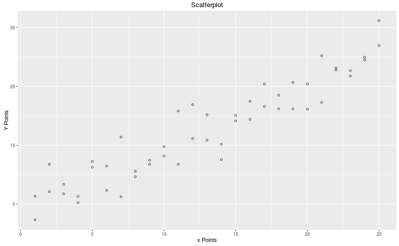

Scatter plots are probably the most easy to interpret data presentation styles that there is, especially when it is in the form of a time-series.
As soon as you see it you start to look for correlations in the data (sometimes this is a bad idea!) and it just feels intuiative.

We can use `ggplot` to add simple regression lines to our data to look for best fit lines.
Here we add a linear regression

```r
# With a simple regression line
ggplot(dat2, aes(x=xs, y=ys)) + geom_point(shape=1) + geom_smooth(method=lm) + labs(list(title = "Scatterplot", x = "x Points", y = "Y Points"))
```
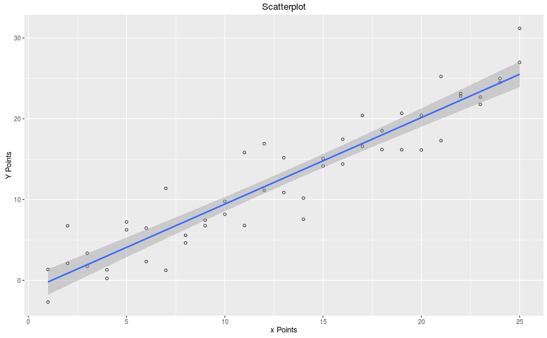

As we created out data using the function $$ y = x + e $$ where e is a gaussian distribution around the mean $$ \mu = 0 $$ we would expect our regression line to approximate $$ y = x $$ and this is certainly the case.

### Error bars

When data is sampled it is used to make an estimation of some quantities in the population.
For example we could sample a population, measure some metric of interest and take the sample mean, we would then use this mean to help us estimate the population mean.
All sampling contains errors and uncertainties, this uncertainty must be accounted for in our statistical analysis and also in the ways we display data.
Most people (researchers in particulat!) will have seen many error bars in their life and work.
Unforunately, mistakes in their interpretation still continue.

The misinterpretation of errors bars comes from the fact that there are several types in regular use and many figures do not make it clear which one they are using.
Typically there are three types of error bar in use

- Standard Deviation (s.d.) based. These bars represent one standard deviation to either side of the sample mean.
These error bars give a notion of the spread of the data but are not necessarilly helpful when looking at the significance of results as they do not change with sample size.
- Standard Error from the Mean (s.e.m.). This can be calculated from the s.d. ($$ s.e.m. = frac{s.d}{sqrt{n}} $$) and this error bar will get smaller with greater sample size.
Be careful to note that if s.e.m. bars do not overlap that does not imply that the result is statistically significant, the p-value is still required. [^1]
- Confidence Interval (CI). Common CI bars will be 95% confidence intervals, these represent a range which will contain the population mean 95% of the time. Intuatively if we were to repeat a sampling 20 times and calculate 95% confidence intervals we would expect 19 out of 20 of these intervals to cover the true population mean.

[^1]: Krzywinski, M., & Altman, N. (2013). Points of significance: Importance of being uncertain. Nature Methods, 10(9), 809–810. [http://doi.org/10.1038/nmeth.2613](http://doi.org/10.1038/nmeth.2613)

#### Plotting Error Bars with ggplot2

Plotting bar charts or line graphs with `ggplot` is relatively simple after you have calculated the means and desired error measurement (s.d, s.e.m. and CI).
If you wish to follow along with this in `r` please download [summarySE.r](scripts/summarySE.r) [^2], this script will provide a function that will calculate these metrics from our data set.

[^2]: [Converting data between wide and long format ](http://www.cookbook-r.com/Manipulating_data/Converting_data_between_wide_and_long_format/)

We will use a set of data built into `r` for this as it is more appropriate for our visualisation.
The set we will use is `chickenwts` which is a set of data that contains the weights of chickens after being given particular diets.

```r
#import chicken weight data set
cw <- chickwts

#ensure that you have the summarySE.R script downloaded
tcw <- summarySE(cw, measurevar = "weight", groupvars = "feed")
```

Now we can look at the tcw summary table and see what we have.

|   | feed      | N  | weight   | sd       | se       | ci       |
| - |:---------:|:--:|:--------:|:--------:|:--------:|:--------:|
| 1 | casein    | 12 | 323.5833 | 64.43384 | 18.60045 | 40.93931 |
| 2 | horsebean | 10 | 160.2000 | 38.62584 | 12.21456 | 27.63126 |
| 3 | linseed   | 12 | 218.7500 | 52.23570 | 15.07915 | 33.18898 |
| 4 | meatmeal  | 11 | 276.9091 | 64.90062 | 19.56827 | 43.60083 |
| 5 | soybean   | 14 | 246.4286 | 54.12907 | 14.46660 | 31.25319 |
| 6 | sunflower | 12 | 328.9167 | 48.83638 | 14.09785 | 31.02916 |

We can now plot these with different error bar methods (replacing the `sd` for `se` or `ci`)

```r
# Create bar chart of chicken weight dataset with s.e.m bars
ggplot(tcw, aes(x=feed, y=weight, fill=feed)) +
  geom_bar(position=position_dodge(), stat="identity", colour="black") +
  geom_errorbar(aes(ymin=weight-sd, ymax=weight+sd),width=.3,size=0.7) +
  labs(list(title = "Chicken Weight with s.e.m bars", x = "Feed", y = "Weight"))
```

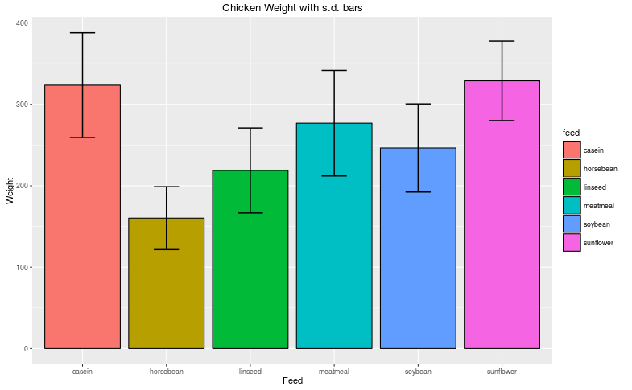 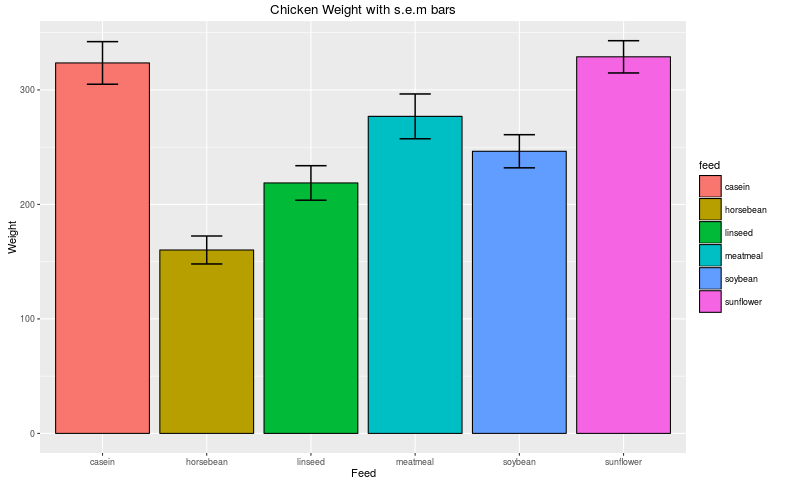 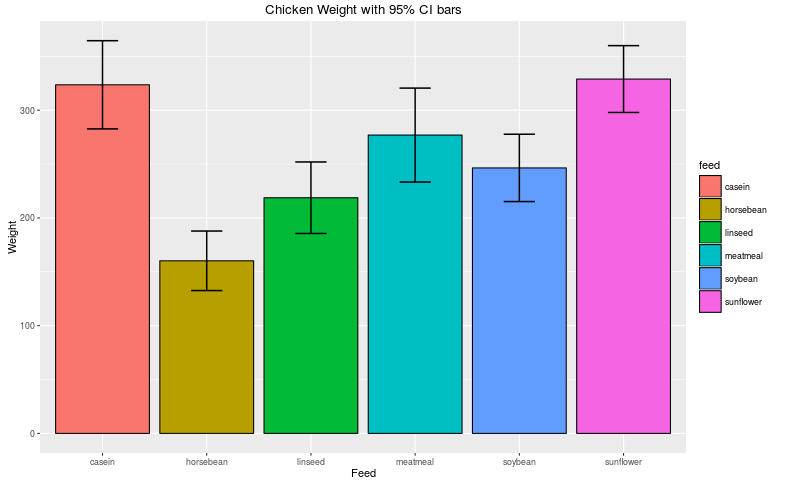

We can see here quite clearly that on the same data, different error bars can make the data look very different.
Be sure to make it clear when presenting data with error bars which one your are using and what they represent.
Also if you are making comparisons or testing significance remember to put p-values along with your error bars for full clarity.

### Histograms

It is a fundamental principle in modern practical data analysis that all investigations should begin, wherever possible, with one or more suitable diagrams of the data.
Such displays should certainly show overall patterns or trends, and should also be capable of isolating unexpected features that might otherwise be missed.
The histogram is a commonly-used display, which is useful for identifying characteristics of a data set.
We can represent the hisograms of our `dat` data treatments using `geom_histogram`

```r
#define subsets of dat for only conditions A or B
dat.a = dat[which(dat$cond == "A"),]
dat.b = dat[which(dat$cond == "B"),]

#plot condition A histogram
ggplot(dat.a, aes(rating)) + geom_histogram(colour="black", fill="light blue", binwidth=.5, alpha=.5, position = "identity") + labs(list(title = "Histogram of treatment A", x = "Measurement", y = "Count"))
```

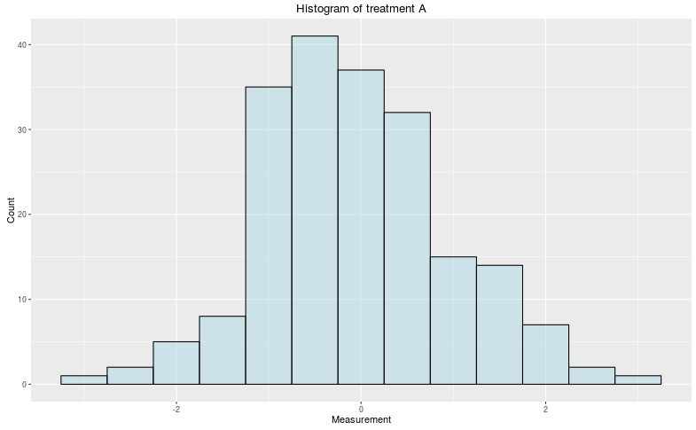

and for both conditions on the same figure

```r
ggplot(dat, aes(rating, fill = cond)) + geom_histogram(binwidth=.5, alpha=.5, position = "identity") + labs(list(title = "Two Histograms", x = "Measurement", y = "Count"))
```

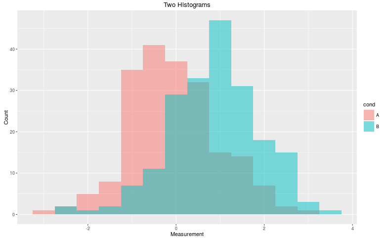

A histogram of a data set gives you an estimate of the probablillity distribution of the variables that you are investigating.
It simply counts the number of data points in the range of the bins and plots the frequency on the y-axis.

### Box plots

Box plots are a very powerful and simple tool for representing data sets via the characteristics of their distribution.
For a box plot we need only know the quartiles (25<sup>th</sup> percentile, median (50<sup>th</sup> percentile) and 75<sup>th</sup> percentile) and the inter-quartile range.
The **"whiskers"** on a box plot can be represented by different values so you will always need to check this when analysing them.
Commenly the whiskers will be ended at the final data point in the set that is at most 1.5 times the interquartile range from the box.
Other values are considered to be outliers and can be represented as points beyond the plot.
Box plots can also be shown where the **"whiskers"** extend all the way to the maximum and minumum of the data.
Here we shall use our seed data `dat` for creating box plots in `ggplot`

```r
ggplot(dat, aes(x=cond, y=rating)) + geom_boxplot() + labs(list(title = "Two Box Plots", x = "Treatment", y = "Measurements"))
```

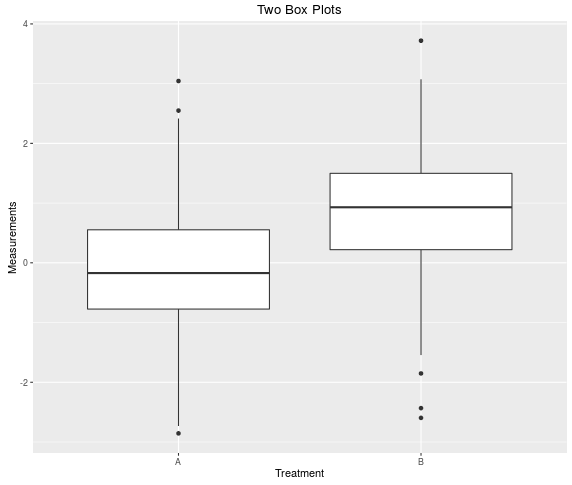

Box plots are very clear to understand for most people and as such are highly recommended when presenting data to others.
We can clearly see in this plot the medians, ranges and general distribution of our data set in two simple boxes without lots of messy points!

Using box plots is particularly helpful when dealing with asymmetric or unknown distributions.
The points displayed in a box plot are quartiles and quartiles are insensitive to outliers and as such are superior at representing the centre of the data than means or standard deviations which will be skewed by "long tailed" distributions.

The two data sets in `dat` are both generated from normal distributions so we might expect them to be better represented using density plots or hisograms.
The next plot represents `dat` but plotted using a density plot (an attempt at a continuous representation of the data distribution).
Do you think the box plot or density plot is more easily understood?

```r
ggplot(dat, aes(rating, colour = cond)) + geom_density() + labs(list(title = "Two Density Plots", x = "Measurement", y = "Density"))
```

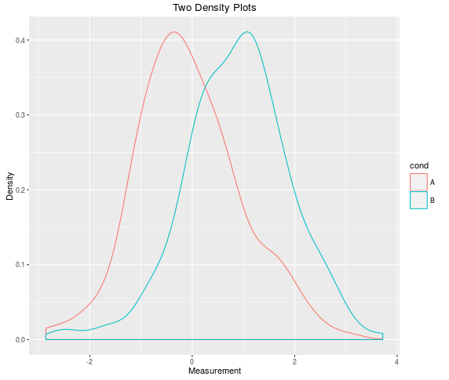

#### Skewed Distributions

Box plots can be particularly useful when looking at non symmetrical distributions.
As we mentioned, the quartiles used in box plots are insensitive to outliers or assymetry whereas the mean will be influenced by very large or small outliers.

Below we show two more plots of distributions similar to `dat` but adding a skew to the distribution so that it has a long tail.
When we look at the density plot we can see the shape of the new distributions.
The box plot still presents this new **messier** data clearly.

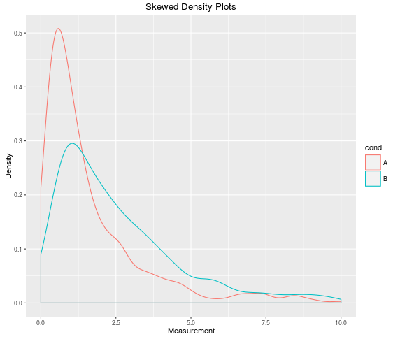 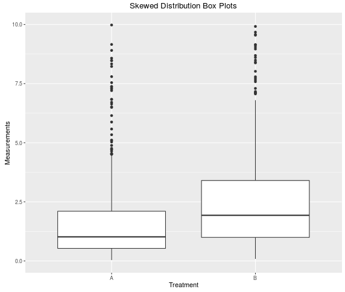
