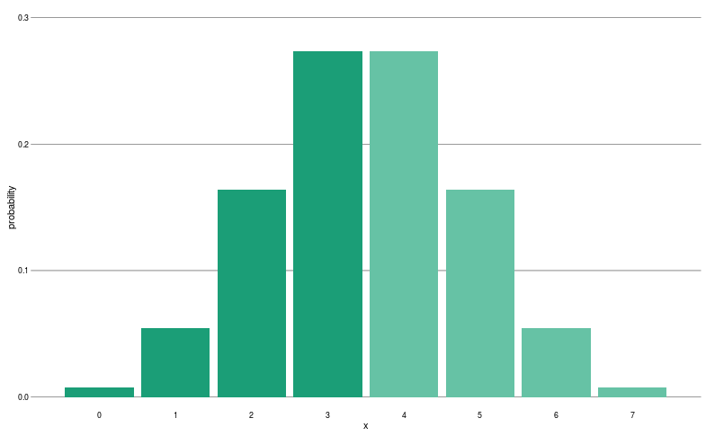

## Distributions

...

### Normal Distribution

...

### Bernoulli Distribution

...

### Hypothesis Testing

...

### Parametric and Non-Parametric Tests

Many statistical tests involve some number of assumptions about the probability distributions underlying the data, these can be categorised as **parametric tests**.

For instance, the Student's $$ t $$-test involves the assumption that the data is normally distributed.
If the underlying distribution was not normal, then $$ t $$-test statistic would not in general have a Student's $$ t $$-distribution, and therefore any p-value calculation would be incorrect.
How serious this would be in practice would depends on the deviation from the true underlying distribution to a normal distribution.

Such a restrictive condition (the assumption of a normal distribution) does not apply for all parametric tests; others are based on large-sample approximations which are valid for a wide range of underlying distributions.
In other circumstances it may be possible to *transform* the data, to apply an appropriate function to all the data values, so that the transformed data can be (approximately) described by an appropriate probability distribution.

> Note that you will be already be familiar with at least one non-parametric test -- a histogram can be described as a simple non-parametric estimate of a probability distribution.

It is not always possible to identify an appropriate test or transformation for a given dataset.  
In such cases, techniques that do not assume a specific probability distribution for the data must be used.
These are known as **non-parametric** tests.
An examples of a non-parametric test follows.

#### The Sign Test

The earliest known example of a non-parametric test dates back to John Arbuthnot in 1710.

> Arbuthnot, J. (1710) An Argument for Divine Providence, taken from the constant Regularity observ'd in the Births of both Sexes.
*Philosophical Transactions*, **27**, 186--190.

For each year in the 82-year period from 1629 to 1710 he observed from City of London records that the number of boys born exceeded the number of girls born.
If births of boys and girls were equally likely, then the probability of such an outcome would be $$ 0.5^{82} $$, which is very small.
He therefore concluded that, for every birth, the probability of a boy was greater than that of a girl; he rejected the null hypothesis that the probabilities were equal.

> Arbuthnot also concluded that the observation constituted clear evidence for divine providence since, as wars and diseases result in a higher death rate for males, God had compensated by arranging for more males to be produced, and hence arranged 'for every woman her proper husband'.

Note that Arbuthnot's test makes no assumptions about the distribution of the number of births for either sex.

Arbuthnot's test is now commonly called the **sign test**.
The principle of the test is as follows: if you have paired data (such as Arbuthnot's numbers of male and female births for each year), calculate the differences and count those that are positive.
This count is the test statistic.

If the distribution of the differences is centred on zero in the sense that zero is its median, then you can expect roughly as many $$ + $$ signs as $$ - $$ signs; so you can obtain a significance probability by using a binomial distribution, $$ {B\hspace*{-3pt}\left(n,\frac12\right)} $$ (where $$ n $$ is the sample size).
Arbuthnot subtracted the number of girls recorded from the number of boys for each of 82 years and obtained 82 $$ + $$ signs.

> Ehlers, N. (1970) On corneal thickness and intraocular pressure. II.
A clinical study on the thickness of the corneal stroma in glaucomatous eyes.
*Acta Ophthalmologica*, **48**, 1107--1112.

#### Example - Corneal Thickness -- The Sign Test

The table below gives the corneal thickness of eight people, each of whom had one eye affected by glaucoma. Corneal thickness in patients with glaucoma (microns)

| Patinet Number   | 1   |  2  |  3  |  4  |  5  |  6  |  7  |  8  |
|:----------------:|:---:|:---:|:---:|:---:|:---:|:---:|:---:|:---:|
| Glaucomatous Eye | 488 | 478 | 480 | 426 | 440 | 410 | 458 | 460 |
| Normal Eye       | 484 | 478 | 492 | 444 | 436 | 398 | 464 | 476 |

We want to use this data to investigate whether there is a difference between corneal thickness in an eye affected by glaucoma compared to a patient's other eye.
A $$ t $$-test for zero mean difference would involve calculating the differences between the thicknesses in the two eyes, and assuming that these differences are adequately modelled by a normal distribution.

The differences (glaucomatous eye $$ - $$ normal eye) are as follows.
$$ 4,\; 0,\; -12,\; -18,\; 4,\; 12,\; -6,\; -16 $$

There is some evidence that these numbers do not follow a normal distribution, and so we will use the sign test to investigate the null hypothesis that the underlying *median* difference is zero.
We count the number of positive differences, and the number of negative differences (it is common practice to ignore zeros, reducing the sample size accordingly).
In this dataset there are three positive numbers and four negative numbers; so three positive numbers out of seven data points.

Using the null hypothesis, we assume equal probability for positive and negative numbers, so the distribution of positive and negative numbers will be given by $$ B\left(7,0.5\right) $$.

Performing a one-sided test, the p-value is the probability of three or fewer positive numbers out of seven, $$ p=0.5 $$.
In R this can be calculated by:

```r
> pbinom(3,7,0.5)
[1] 0.5
```

This result is illustrated by a bar chart of the Bernoulli distribution:



The lower tail (3 or fewer) contains the values 0, 1, 2, and 3; the upper tail (more than 3) contains the values 4, 5, 6, and 7.
We can see that the probabilities of being in either tail are equal.
This provides absolutely no evidence against the null hypothesis;  there is no evidence of a difference in corneal thickness.

---

### Exercise

> Student (1908) The probable error of a mean.
*Biometrika*, **6**, 1--25.

This exercise concerns some data on the possible hypnotic effect in humans of the drug L-hyoscyamine hydrobromide.
Ten individuals had their sleep time measured before and after taking the drug.
The differences in sleep time (time after taking the drug $$ - $$ time before taking the drug) are given in the table below. Sleep gain (hours) when patients take L-hyoscyamine hydrobromide.

| Patient Number | 1   | 2   | 3   | 4   | 5    | 6   | 7   | 8   | 9   | 10  |
|:--------------:|:---:|:---:|:---:|:---:|:----:|:---:|:---:|:---:|:---:|:---:|
| Gain           | 1.9 | 0.8 | 1.1 | 0.1 | -0.1 | 4.4 | 5.5 | 1.6 | 4.6 | 3.4 |

We can analyse this data using a (one-sided test) $$ t $$-test with the null and alternative hypotheses as follows:
$$ H_0: \mu = 0,\quad H_1: \mu > 0, $$
where $$ \mu $$ is the underlying mean sleep gain.
The p-value for this test was $$ 0.0025 $$; there was strong evidence against the null hypothesis, that this substance does work as a hypnotic.

While there is no particular reason to doubt that this data follows a normal distribution, we can still analyse it using the sign test.
The hypotheses will need to be amended as follows:
$$ H_0: m = 0,\quad H_1: m > 0, $$
where $$ m $$ is the median sleep gain.

##### Question

 What is the value of the sign test statistic for these data? Calculate the corresponding p-value and report your conclusion?

 *Solution*

 There is one negative value out of ten.
 The value of the sign test statistic is calculated using the Binomial distribution.
```r
> pbinom(1,10,0.5)
[1] 0.0107
 ```
 So there is strong evidence against the null hypothesis (but with a lesser significance that given by the $$ t $$-test).
