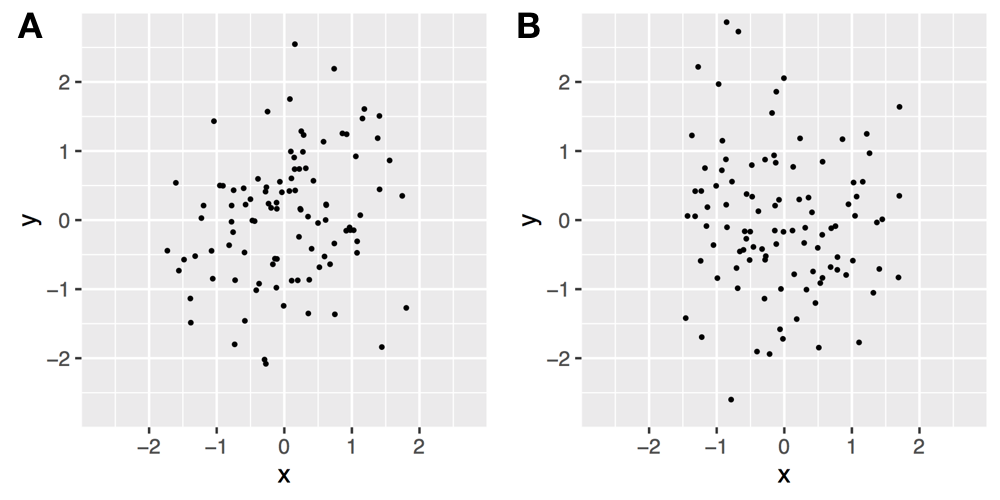
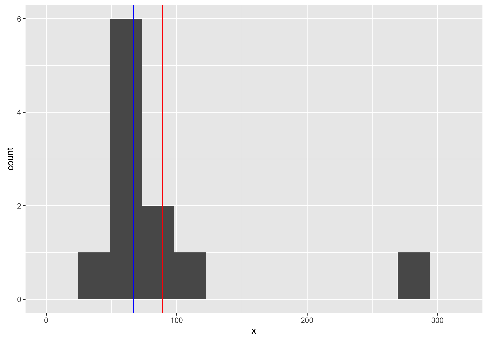

# How to think about statistics

## Introduction

> Prediction is very difficult, especially about the future. — Niels Bohr

Humans seem particularly well adapted to seek patterns and correlations in our environment, whether or not those patterns are real.
This pattern-seeking behaviour seems to have served us exceptionally well over evolutionary time-scales, where the occasional correct response to a high-cost situation more than makes up for multiple low-cost errors^[Foster, K. R., & Kokko, H. (2009). The evolution of superstitious and superstition-like behaviour. Proceedings of the the Royal Society B, 276(1654), 31–37. <http://doi.org/10.1098/rspb.2008.0981>].
After all, it is far safer to assume that the rustling of leaves is a predator and not simply the wind.

The issues begin to arise when we use these same pattern-recognition processes in modern environments.
While there are many advantages in predicting outcomes via inspiration or intuition, there are as many or more examples of when this behaviour goes wrong.
Consider for example:

- [Pareidolia](https://en.wikipedia.org/wiki/Pareidolia) the phenomenon where faces are observed on everyday items (the moon; food).
- The vast array of conspiracy theories that link semi-random events into one grand narrative.
- Many other superstitions that link arbitrary actions with unrelated outcomes.

The particular problems we, as bioscientists, are likely to face with our innate pattern-seeking behaviour is the spurious identification of biological processes as causally related from given data (or more rarely the inverse – assuming related processes are not).
Upon these incorrect facts we then build whole theories and predictions, which can come crashing down around us far too late, wasting time, money, and resources.
So while it is not our fault that we are bad at distinguishing which patterns are real and which are spurious, we have the responsibility as scientists to be aware of our own limitations.

Luckily for us, over the past centuries our predecessors have developed many different rules and tools to help us determine which patterns are real.
Some of the most powerful of these can be categorised as **statistical methods**.
Given some data sampled from a process, these methods consist of applying a mathematical equation or algorithm to generate a number (or a set of such numbers) which we call a **statistic**.
For instance we can find numbers to summarize the general location of the data (the **mean** or the **median**), to indicate how spread out the data is (the **standard deviation** or the **interquartile range**), and to determine whether two sets of data are similar or different.
Whatever they may characterise, we use our statistics as summary evidence to make statements about our data and so infer the properties of the process that generated this data.
Often we can also apply a rule, or a set of rules, to the final statistic to guide our further analysis.

While so far we have focused on our tendency to see patterns where none exist, the opposite is also possible: not seeing correlations when they do exist.
We can also see the power of statistical methods in these instances.

### Exercise: Predicting statistical significance

In this module we will talk in detail about **statistical significance** and its role in determining whether a pattern or effect exists.
Broadly, a result is statistically significant if the summary statistic is less than a predetermined significance level.
(Note: statistical significance is not biological significance!)
To show the strength of statistical testing, consider the following two graphs, **A** and **B**.
One of these has a statistically significant correlation, the other has not.

If you suspected that graph **A** is has the significant correlation, you are correct.
However, by eye there is not a huge difference between the two graphs, but by using statistics, we can show that the [p-value](#p-values) for graph **A** is 0.023, which is less than the standard significance level of 0.05.
Meanwhile the p-value for graph **B** is 0.341, which is above this significance level.

If you had difficultly with determining which of the graphs showed a significant correlation, you are not alone.
In a previous randomised test, only 47% of subjects correctly classified statistically significant correlations^[Fisher, A., Anderson, G. B., Peng, R., & Leek, J. (2014). A randomized trial in a massive online open course shows people don't know what a statistically significant relationship looks like, but they can learn. PeerJ, 2, e589. <http://doi.org/10.7717/peerj.589>].

Though statistical methods do give us a useful tool for removing some of the subjectivity from our data analysis, *they should not be applied blindly*.
If we are told that a given statistical method can (or should) be applied to a given type of data *without understanding why*, we are merely resorting back to our pattern-seeking behaviour.
The same applies to any statistic, or rule of thumb applied to a statistic; if we do not understand what that statistic *really means* then we cannot be confident in our conclusions.

<!-- TODO write "In this chapter, ... " section -->

## How to use statistics

> To call in the statistician after the experiment is done may be no more than asking him to perform a post-mortem examination: he may be able to say what the experiment died of. — Ronald Fisher

<!-- Reasons to use statistics -->
Statistical methods are *designed tools* that allow us to remove some of the subjectivity and arbitrariness introduced into data-analysis by humans.
Through their application, we create consistency in our approaches and place ourselves at one step of removal.
However, by using these tools in the scientific process we open ourselves up to a new series of problems, all of which require specific care and consideration.

<!-- What method to use -->
Perhaps the most difficult problem, yet the most important, is determining which methods are applicable and useful *in the first place*.
This can be further extended to the problem of knowing which statistical tests *exist* for us to use.
Often this can seem a bit too much like a black art (statisticians having 'spell books' full of arcane rituals).
Of course, we won't have the time or space to introduce you to all possible statistical tests in this module.
But we hope to be able to help your requirements into words, either for asking for help or searching the web.
And for those methods we do introduce, we will focus on explaining why you would use them and how they work.

<!-- With care... -->
Even when we know which tests are applicable, often the choice of and application of particular tests can be subjective.
Worse still is the blind application of statistical methods, where the user lacks a real understanding of what the method does, or what the resulting statistics mean.
Therefore we must emphasise that any method should be applied in **an informed way, with care**.
Any deviation from this rule means that at best we may have wasted our time, and at worse we cannot really be sure of what our resulting statistics mean.
In which case, we cannot *ethically* use them to support or refute a biological statement.
<!-- TODO e.g. mean vs. median -->

### Exercise: Choosing an appropriate statistical method
Consider the following dataset:

    81, 51, 101, 284, 65, 70, 66, 39, 95, 67, 60

We would like to find the average of this data.
Using R, or an alternative method, find the *mean* and the *median* of this data.
Then plot the distribution of the data (using a histogram), and determine whether the mean or the media is the more representative statistic of the sample as a whole.

Using R, we obtain:

    > x <- c(81, 51, 101, 284, 65, 70, 66, 39, 95, 67, 60)
    > mean(x)
    [1] 89
    > median(x)
    [1] 67
    ggplot(data.frame(x), aes(x=x)) + geom_histogram(bins=10) +
      geom_vline(xintercept=mean(x), colour='red') +
      geom_vline(xintercept=median(x), colour='blue')

With this data, because of the single outlier, the median is a more representative average statistic, as it lies closer to the peak in the distribution of the data.

<!-- With context -->
The context of a biological dataset is also important when considering the best approach for statistical analysis.
A time-series will need different considerations than independent measurements (for a time-series it's probable that each data point will be dependent on the last).
What are your sources of error?
Do they arise from inter-subject variability, or measurement error?
Also, it may or may not be appropriate to normalise or otherwise standardise or remove outliers from your data.
Often this choice is again subjective, the best solution is always to be **completely transparent about your choices** and why you have made them.

<!-- Reasons not to use statistics -->
In some cases, the best option can be not to use statistical methods at all.
Reasons why this may be the case can include not knowing a method which is applicable to a given problem, or where the data is best represented in another fashion, e.g. as tabulated data or a plot.
We shall see a little later that the best approach for determining the 'normality' of data is to observe (by eye) their Q-Q plots.

When statistical methods have been suitably chosen and applied, the resulting statistics should not be referred to as ultimate truths, without context or nuance.
Instead statistics should be seen to provide *summarised information*, for which it is the users role to interpret.

<!-- Stat/exp cycle -->
Finally, it also matters *when* the statistical methods to be used will be chosen.
These methods should, as a rule, be determined before the data collection begins.
Otherwise we will often find it possible to try multiple different statistical tests, to find one that gives us the answer we want.
This requirement also needs to extend to determining the number of replicants before starting the experiment, and not analysing partially collected data, both of which open us to the possibility of starting or ending the data collection early, when *by chance* we find a statistically significant effect.

We will return to each of these ideas later.
