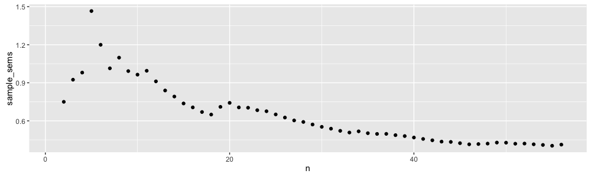

## Using uncertainty

> 33⅓% of the mice used in the experiment were cured by the test drug; 33⅓% of the test population were unaffected by the drug and remained in a moribund condition; the third mouse got away. — Erwin Neter

**Read the article:**

Krzywinski, M., & Altman, N. (2013). Points of significance: Importance of being uncertain. Nature Methods, 10(9), 809–810. <http://doi.org/10.1038/nmeth.2613>

This article explains how statistical methods allow us to productively use the uncertainty inherent in biological experiments.
It introduces some of the terminology and notation that we will need later, but for now we will further discuss some of the introduced concepts.
(We will continue to use articles from the *Points of significance* column throughout this module^[For a complete list of these articles see [the *Nature Methods* website](http://www.nature.com/collections/qghhqm/pointsofsignificance).].)

The article describes a **population distribution** as the 'frequency histogram of all possible values of an experimental variable'.
This means that we are considering a graph, with the x-axis corresponding to each possible value of the experimental variable, and the y-axis corresponding to the frequency that that value is observed (alternatively the probability of observing that value).
Typically, for a *continuous* experimental variable^[A **continuous variable** is one that can take any (fractional, decimal) value between its maximum and minimum. The alternative is a **discrete variable**.] the frequency histogram would be understood to have bins of infinitesimal (effectively *very small*) width.
For example, consider the following three distributions:

On the left is a **normal distribution** (sometimes: **Gaussian distribution**), and on the right is a **uniform distribution**.
These are two standard distributions that can be mathematically defined, and we will continue to discuss normal distributions later in the course.
However, real data may often more look like the (arbitrary) distribution in the centre.
One important distribution fact is that (exactly like any other frequency histogram) the *area under the curve* must sum to 1.
Here we can see this most easily in the normal distribution.
Often we don't know the properties (e.g. mean, $\mu$, and standard deviation, $\sigma$) of an underlying population distribution, and so we must estimate them by *sampling*.

**Samples** are sets of data drawn from the distribution of a given size ($n$), sometimes labelled $X$, $X_1$, or similar.
As the article states: 'In general, a sample will not resemble the population unless $n$ is very large.'
We can directly calculate the mean, $\bar{X}$, and the standard deviation, $s$, of a particular sample (e.g. by importing our data into R).

If we imagine drawing the frequency histogram of the mean of all possible samples (of a given size) we obtain another distribution: **the sampling distribution**.
Imagine taking a sample, $X_1$, of size $n$ from our population distribution.
The mean of this sample is $\bar{X}_1$.
Then the sampling distribution tells us how likely we were to calculate a particular value of $\bar{X}_1$ ^[Alternatively, consider a population distribution from which we have taken (infinitely) many samples ($X_1, X_2, X_3, \ldots$).
Take the mean of each of these ($\bar{X_1}, \bar{X_2}, \bar{X_3}, \ldots$).
Then the frequency histogram of these means corresponds to the sampling distribution.].
The calcualted standard deviation of the means of the samples is known as the **standard error of the mean (s.e.m.)**.

The means and standard deviations of the population distribution, an individual sample, and the sampling distribution are all distinct concepts.
To be clear, we label:

- Statistics for *population distributions* using greek letters: the mean using $\mu$ (mu); and the standard deviation using $\sigma$ (sigma).
- Statistics for *a particular sample* using roman letters: the mean using $\bar{X}$; and the standard deviation using $s$.
- Statistics for *sampling distributions* using greek letters with subscripts: the mean using $\mu_\bar{X}$; and the standard deviation using $\sigma_\bar{X}$.

### Exercise: Population means versus sample means

To demonstrate the distinction between each of these measures: imagine you have just installed a new piece of experimental equipment.
You are told by the manufacturer that the error on a given measurement is known to follow a normal distribution with mean 0 and standard deviation 0.8 (the population distribution).

Over the next seven days, you run the machine with a blank to obtain seven samples of size $n=5$:

    x1 = -1.64,  0.43,  1.24, -0.81, -0.86
    x2 =  0.48,  0.35, -1.48, -0.02, -1.28
    x3 =  0.20, -2.28,  0.06, -0.85,  1.67
    x4 = -2.14,  0.58,  1.22,  0.55,  0.15
    x5 =  0.87,  0.20, -0.40,  0.76, -0.91
    x6 = -2.04, -0.05,  0.28, -1.85,  0.08
    x7 = -0.10,  1.46, -1.30, -0.82, -0.67

Using R or otherwise:

1. Find the mean and standard deviation of each of these samples.
2. Find the mean and standard deviation of the mean, in order to find estimates for the sampling distribution parameters $\mu_\bar{X}$ and $\sigma_\bar{X}$.

Using R, we obtain:

    > x1 <- c(-1.64,  0.43,  1.24, -0.81, -0.86)
    > x2 <- c( 0.48,  0.35, -1.48, -0.02, -1.28)
    > x3 <- c( 0.20, -2.28,  0.06, -0.85,  1.67)
    > x4 <- c(-2.14,  0.58,  1.22,  0.55,  0.15)
    > x5 <- c( 0.87,  0.20, -0.40,  0.76, -0.91)
    > x6 <- c(-2.04, -0.05,  0.28, -1.85,  0.08)
    > x7 <- c(-0.10,  1.46, -1.30, -0.82, -0.67)

    > sample_means <- c(mean(x1), mean(x2), mean(x3), mean(x4),
    +                 mean(x5), mean(x6), mean(x7))
    > sample_means
    [1] -0.328 -0.390 -0.240  0.072  0.104 -0.716 -0.286

    > sample_sds <- c(sd(x1), sd(x2), sd(x3), sd(x4),
    +                 sd(x5), sd(x6), sd(x7))
    > sample_sds
    [1] 1.1478110 0.9248784 1.4547680 1.2945540 0.7596907 1.1300575 1.0658236

    > mean(sample_means)
    [1] -0.2548571
    > sd(sample_means)
    [1] 0.2807938

We can see that the means and standard deviations of the population distribution, an individual sample, and the (estimate of) the sampling distribution all come out to different numbers.

Finally, the article shows us how we make use of (sets of) samples, and the sampling distribution in order to estimate the properties of the population distribution.
Using something called the **central limit theorem (CLT)** we know that we can use our calculated statistics for the sampling distribution to estimate the statistics for the original population distribution.
We have:

- $\mu_\bar{X} = \mu$, the mean of the sampling distribution equals that of the population distribution.
- $\sigma_\bar{X} = \frac{\sigma}{\sqrt{n}}$, the standard deviation of the sampling distribution equals that of the population distribution, scaled by $\frac{1}{\sqrt{n}}$.

It is *absolutely crucial* to remember that the values obtained for $\mu_\bar{X}$ and $\sigma_\bar{X}$ from your samples *are only estimates*.
These estimates will improve as the number of samples increases, and as a function of the size of the samples.

### Exercise: Sample sizes

    13.67, 12.17, 10.47,  9.18, 17.64, 13.15, 12.59,
    7.42, 10.10,  8.05,  6.18, 10.05, 11.43, 13.05,
    11.07, 13.52, 12.81, 14.07, 18.25, 18.03, 12.71,
    7.67,  9.03,  7.85, 13.07, 12.62, 10.87, 14.76,
    12.57, 10.90, 13.75, 11.41, 13.61,  6.58, 12.53,
    15.07,  7.54,  9.71, 14.55, 12.72, 11.05, 10.90,
    11.88,  8.21, 11.89, 11.18, 16.16,  6.93, 17.51,
    7.73, 10.98, 16.28,  9.47,  9.22, 10.04,  5.26

Using R or otherwise: reproduce Figure 4 from Krzywinski & Altman, 2013:

1. Import the data.
2. Find the mean, standard deviation, and s.e.m. for each subset of the data, 1 to $n$ where $n=1,2,3,\ldots,56$. (The first subset will be `13.67`; the next `13.67, 12.17`; the next `13.67, 12.17, 10.47`; and so on.)
3. Plot the mean, standard deviation, and s.e.m. as a function of $n$.

Using R, we obtain:

    x <- c(13.67, 12.17, 10.47,  9.18, 17.64, 13.15, 12.59,
            7.42, 10.10,  8.05,  6.18, 10.05, 11.43, 13.05,
           11.07, 13.52, 12.81, 14.07, 18.25, 18.03, 12.71,
            7.67,  9.03,  7.85, 13.07, 12.62, 10.87, 14.76,
           12.57, 10.90, 13.75, 11.41, 13.61,  6.58, 12.53,
           15.07,  7.54,  9.71, 14.55, 12.72, 11.05, 10.90,
           11.88,  8.21, 11.89, 11.18, 16.16,  6.93, 17.51,
            7.73, 10.98, 16.28,  9.47,  9.22, 10.04,  5.26)

    sample_means <- c()
    sample_sds <- c()
    sample_sems <- c()

    for (n in 1:length(x)) {
      sample_means <- append(sample_means, mean(x[1:n]))
      sample_sds <- append(sample_sds, sd(x[1:n]))
      sample_sems <- append(sample_sems, sd(x[1:n]/sqrt(n)))
    }

    df <- data.frame(n=1:length(x), sample_means,
                     sample_sds, sample_sems)

    library(ggplot2)

    # plot sample mean
    ggplot(df, aes(x=n,y=sample_means)) + geom_point()

    # plot sample standard deviation
    ggplot(df, aes(x=n,y=sample_sds)) + geom_point()

    # plot sample s.e.m.
    ggplot(df, aes(x=n,y=sample_sems)) + geom_point()

